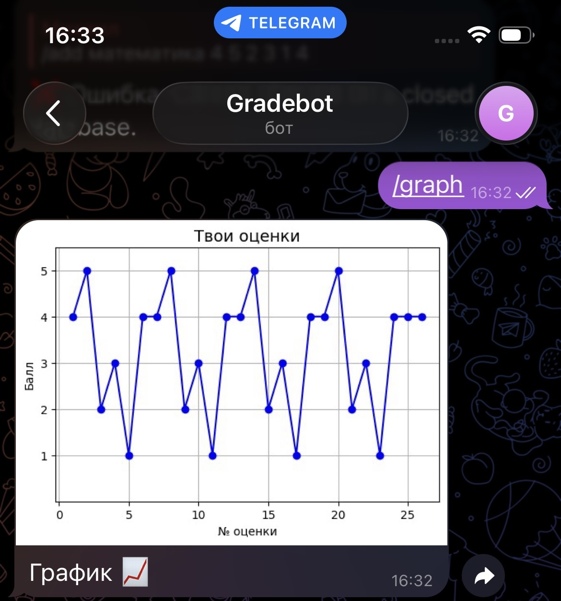
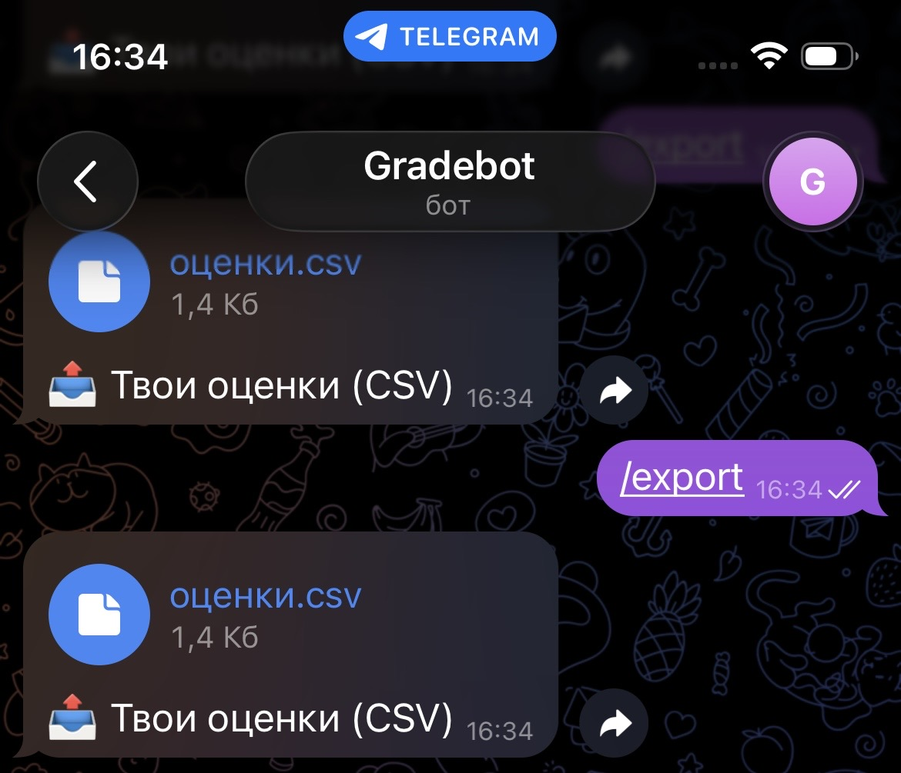

# GradeBot

A smart Telegram bot for tracking school grades — built by a 12-year-old developer.
Stores data securely, validates inputs, and never breaks on invalid input.

> "From `print('Hello')` to Data Engineering in 100 days."

## ✨ Features

- `/add <subject> <grade1> <grade2> ...`
→ Adds grades only for **valid subjects** (e.g., `математика`, `русский`, `физика`)
- `/stats` — shows average score per subject
- `/graph` — visualizes your progress over time
- `/export` — downloads all data as CSV (UTF-8, Excel-ready)
- `/import` — uploads your own CSV file (with validation)
- 🔒 **Strict input validation**: rejects `аааааа`, invalid grades, unknown subjects
- 💾 Persistent storage using SQLite (data survives restarts)

## 🛡️ Robust by design

The bot has been manually tested against:
- Empty commands (`/add`)
- Invalid grades (`6`, `-1`, `пять`)
- Fake subjects (`аааааа`, `физика с лабами`)
- Wrong file formats (TXT, empty CSV, malformed headers)
- Edge cases (one grade, 50 grades, special characters)

✅ All tests passed. No crashes. Only clean, helpful responses.

## 📸 Screenshots






## 🛠️ Tech Stack

- Python 3
- `pyTelegramBotAPI`
- `sqlite3`
- `pandas`
- `matplotlib`

## 🚀 How to Run

1. Get a bot token from [@BotFather](https://t.me/BotFather)
2. Set it in the code:

```python

BOT_TOKEN = "your_token_here"
